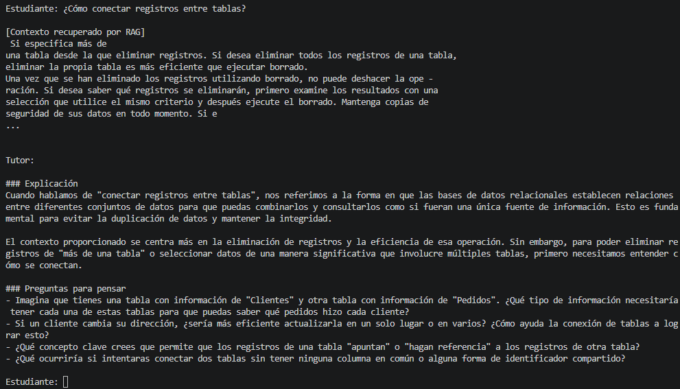
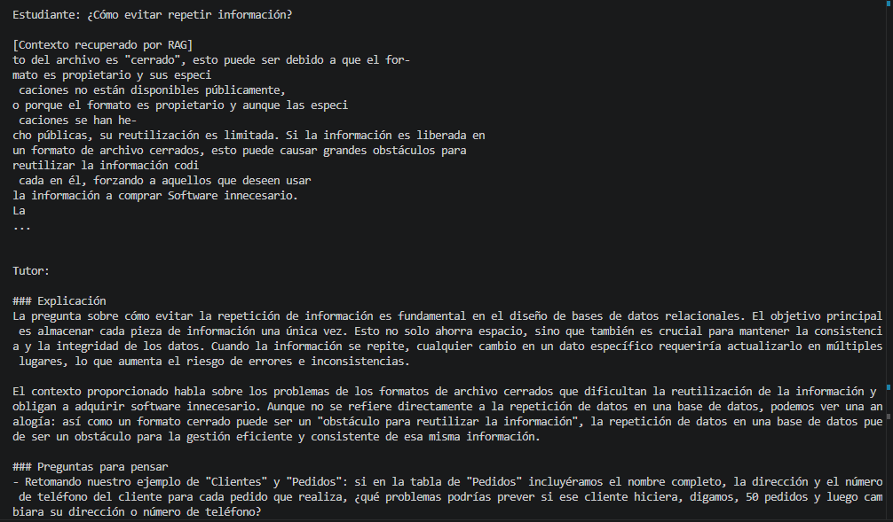
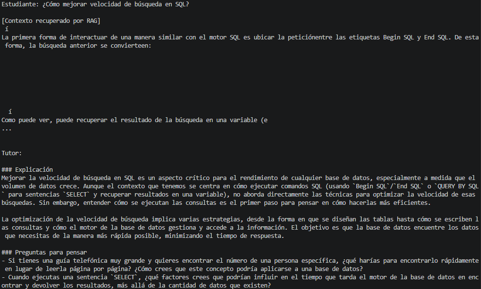
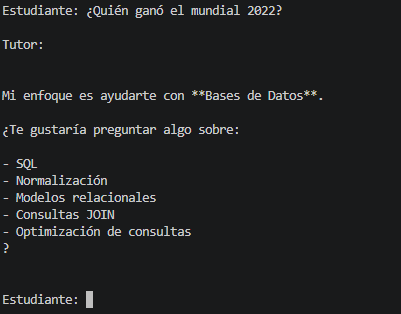
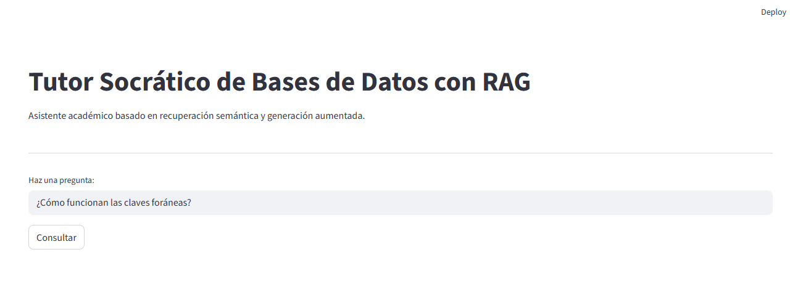
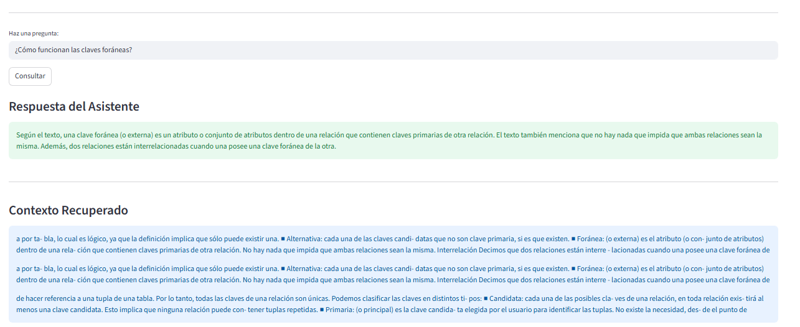
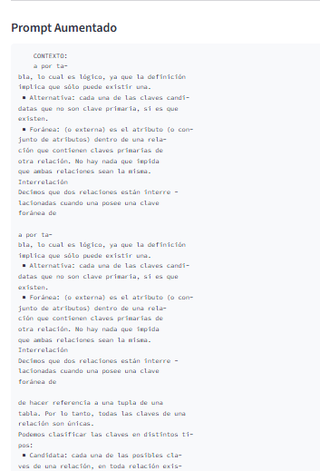
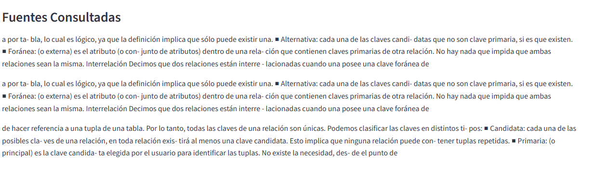
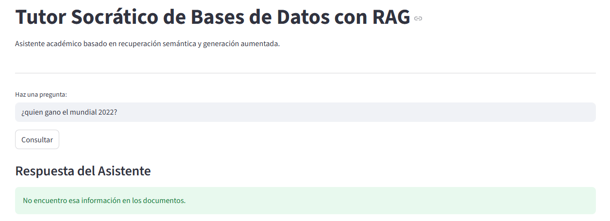

## Autores

Proyecto desarrollado por:

**María Paula Rodríguez Quitián**  
Código: 506231715

**Laura Alejandra Barreto Niño**  
Código: 506222707

---

# Tutor Socrático de Bases de Datos con RAG

## Descripción del Proyecto

Este proyecto implementa un **Asistente Académico basado en Inteligencia Artificial** que funciona como un **Tutor Socrático de Bases de Datos**, potenciado mediante una arquitectura **RAG (Retrieval-Augmented Generation)**.

El sistema no solo genera respuestas con IA, sino que consulta previamente una base documental especializada en Bases de Datos, recuperando contexto relevante antes de responder. Esto mejora la precisión de las respuestas, reduce posibles alucinaciones del modelo y mantiene un enfoque académico guiado.

El asistente analiza preguntas teóricas y consultas SQL, ayudando al estudiante a comprender conceptos o identificar errores mediante preguntas orientadoras en lugar de entregar respuestas directas.

---

## Objetivo del Asistente

El objetivo del sistema es apoyar el aprendizaje de bases de datos mediante:

* Explicaciones basadas en ejemplos del mundo real
* Preguntas guiadas para fomentar el pensamiento crítico
* Análisis de consultas SQL
* Recuperación de conocimiento documental mediante RAG
* Respuestas estructuradas para facilitar el aprendizaje

---

## Tecnologías Utilizadas

* Python
* Google Gemini API
* python-dotenv
* Prompt Engineering
* SentenceTransformers
* ChromaDB
* PyPDF
* Streamlit
* Arquitectura RAG (Retrieval-Augmented Generation)

---

# Núcleo Técnico del Sistema RAG

## Implementación de Embeddings

### Código de Vectorización

El sistema utiliza embeddings semánticos para representar matemáticamente el significado de los documentos y consultas realizadas por el usuario.

Cada fragmento de texto es convertido en un vector numérico utilizando la librería `SentenceTransformers`.

Código utilizado:

```python
from sentence_transformers import SentenceTransformer

modelo = SentenceTransformer("all-MiniLM-L6-v2")

embedding = modelo.encode(texto).tolist()
```

Este proceso permite que el sistema compare significados semánticos en lugar de únicamente palabras exactas.

---

### Justificación del Modelo

Se seleccionó el modelo `all-MiniLM-L6-v2` debido a su equilibrio entre rendimiento y eficiencia computacional.

Este modelo:

* Genera embeddings de 384 dimensiones
* Posee bajo consumo de memoria
* Permite ejecución local eficiente
* Tiene buena velocidad de inferencia
* Ofrece soporte adecuado para recuperación semántica en español
* Es ampliamente utilizado en sistemas RAG ligeros

Gracias a estas características, el sistema puede ejecutarse localmente sin requerir hardware especializado.

---

## Gestión de la Vector Store

### Uso de ChromaDB

El sistema utiliza ChromaDB como base de datos vectorial persistente para almacenar los embeddings generados a partir de los documentos académicos.

Código utilizado:

```python
import chromadb

client = chromadb.PersistentClient(path="vectordb")

collection = client.get_or_create_collection("bases_datos")
```

Los embeddings se almacenan localmente en la carpeta `vectordb`, permitiendo consultas rápidas y persistencia de datos entre ejecuciones.

---

### Recuperación Semántica

Cuando el usuario realiza una consulta:

1. Se genera el embedding de la pregunta
2. Se compara con los embeddings almacenados
3. Se calcula similitud semántica
4. Se recuperan los fragmentos más relevantes

Código utilizado:

```python
resultados = collection.query(
    query_embeddings=[embedding],
    n_results=3
)
```

---

## Similitud de Coseno

La recuperación documental se basa en similitud semántica entre embeddings utilizando métricas vectoriales como similitud de coseno.

Esta técnica permite identificar fragmentos relacionados conceptualmente aunque no compartan exactamente las mismas palabras.

Por ejemplo:

| Consulta | Concepto recuperado |
|---|---|
| ¿Cómo unir tablas? | JOINs |
| ¿Cómo evitar repetir datos? | Normalización |
| ¿Cómo relacionar registros? | Claves foráneas |
| ¿Cómo mejorar búsquedas SQL? | Índices |

---

## Pruebas de Similitud de Coseno

Se realizaron pruebas utilizando preguntas con lenguaje coloquial o sinónimos para verificar la capacidad de recuperación semántica del sistema.

| Pregunta del usuario | Fragmento recuperado | Resultado |
|---|---|---|
| ¿Cómo conectar registros entre tablas? | Explicación sobre JOINs y claves foráneas | Correcto |
| ¿Cómo evitar repetir información? | Fragmentos sobre normalización | Correcto |
| ¿Cómo mejorar búsquedas en SQL? | Explicación sobre índices y optimización | Correcto |
| ¿Cómo unir tablas? | Información relacionada con INNER JOIN | Correcto |

Estas pruebas demuestran que el sistema no depende exclusivamente de coincidencias exactas de palabras, sino que comprende relaciones semánticas entre conceptos.

---

# Evidencias de Recuperación Semántica

## Prueba 1 — Recuperación usando sinónimos

### Pregunta del usuario

```text
¿Cómo conectar registros entre tablas?
```

### Captura de recuperación semántica JOIN



---

## Prueba 2 — Recuperación sobre normalización

### Pregunta del usuario

```text
¿Cómo evitar repetir información?
```

### Captura de recuperación semántica NORMALIZACIÓN



---

## Prueba 3 — Recuperación sobre optimización SQL

### Pregunta del usuario

```text
¿Cómo mejorar velocidad de búsqueda en SQL?
```

### Captura de recuperación semántica ÍNDICES



---

## Prueba 4 — Pregunta fuera del dominio

### Pregunta del usuario

```text
¿Quién ganó el mundial 2022?
```

### Captura de control de alucinaciones



---

# Integración RAG y Lógica de Negocio

## Pipeline de Respuesta

El sistema implementa un flujo completo RAG para responder preguntas académicas utilizando recuperación semántica y generación aumentada mediante Gemini.

---

## 1) Captura de la consulta del usuario

El usuario realiza preguntas desde la interfaz desarrollada en Streamlit.

### Evidencia de consulta del usuario



---

## 2) Recuperación semántica del contexto relevante y generación de respuesta

Cuando el usuario realiza una pregunta:

1. Se genera el embedding de la consulta.
2. Se consulta la base vectorial ChromaDB.
3. Se recuperan los fragmentos más relevantes.
4. Se envía el contexto recuperado al modelo Gemini.
5. Gemini genera una respuesta basada únicamente en el contexto recuperado.

### Evidencia de recuperación semántica y respuesta generada



---

## 3) Inyección de contexto en el System Prompt

El sistema incorpora automáticamente el contexto recuperado dentro del prompt enviado al modelo Gemini.

Ejemplo del prompt aumentado:

```text
CONTEXTO:
Fragmentos recuperados desde la base vectorial.

PREGUNTA:
¿Cómo funcionan las claves foráneas?
```

### Evidencia del Prompt Aumentado



---

# Interfaz Gráfica (GUI)

La aplicación cuenta con una interfaz desarrollada en Streamlit que permite:

* Realizar preguntas académicas
* Visualizar respuestas generadas por Gemini
* Consultar el contexto recuperado
* Mostrar las fuentes utilizadas por el sistema RAG

---

## Captura General de la Interfaz


---

## Fuentes y contexto recuperado

La interfaz permite visualizar los fragmentos utilizados como contexto para generar la respuesta.



---

# Seguridad y Control de Alucinaciones

El sistema fue configurado mediante Prompt Engineering para evitar respuestas inventadas o fuera del dominio académico.

El prompt instruye al modelo a responder:

```text
"No encuentro esa información en los documentos."
```

cuando el contexto recuperado no contiene información suficiente.

---

## Evidencia de control de alucinaciones

Pregunta realizada:

```text
¿Quién ganó el mundial 2022?
```

Respuesta esperada:

```text
No encuentro esa información en los documentos.
```



---

## Diseño del Prompt

El sistema utiliza Prompt Engineering para controlar el comportamiento del modelo de inteligencia artificial.

El System Prompt define:

* El rol del asistente (Tutor Socrático de Bases de Datos)
* Las reglas de interacción
* El uso prioritario del contexto recuperado por RAG
* El formato estructurado de salida
* Restricciones para evitar alucinaciones

Se utilizan delimitadores estructurados para organizar el prompt:

```text
<rol>
<contexto>
<reglas>
<formato_respuesta>
```

---

## Flujo RAG Implementado

El sistema implementa una arquitectura RAG (Retrieval-Augmented Generation) para enriquecer las respuestas del tutor con información documental relevante.

### 1) Selección documental

Se recopilaron documentos académicos relacionados con:

* SQL
* JOINs
* Normalización
* Claves primarias y foráneas
* Integridad referencial
* Modelos relacionales
* Optimización de consultas

Estos documentos son almacenados localmente en la carpeta `/documentos`.

---

### 2) Chunking

Los documentos son fragmentados en bloques de texto (chunks) de aproximadamente 500 caracteres, con un solapamiento de 100 caracteres.

---

### 3) Vectorización Semántica

Cada chunk es convertido en un embedding vectorial utilizando el modelo:

```text
all-MiniLM-L6-v2
```

Esto permite representar matemáticamente el significado semántico de cada fragmento documental.

---

### 4) Base Vectorial

Los embeddings generados se almacenan localmente en una base vectorial usando ChromaDB.

---

### 5) Recuperación de Contexto

Cuando el usuario realiza una pregunta:

1. Se genera el embedding de la consulta
2. Se compara con la base vectorial
3. Se recuperan los fragmentos más relevantes
4. Dicho contexto se incorpora al prompt

---

### 6) Generación Aumentada

Finalmente, el prompt enriquecido se envía al modelo Gemini, que genera una respuesta guiada usando:

* contexto documental recuperado
* reglas pedagógicas del tutor
* enfoque socrático

---

## Arquitectura General

```text
Documentos PDF/TXT
      ↓
Extracción de texto
      ↓
Chunking
      ↓
Embeddings
      ↓
Base Vectorial (ChromaDB)
      ↓
Retrieval
      ↓
Prompt enriquecido
      ↓
Gemini
      ↓
Respuesta Socrática
```

---

## Evaluación del Sistema RAG (RAGAS)

Con el fin de medir objetivamente el desempeño del pipeline RAG implementado, se realizó una evaluación utilizando la librería RAGAS (Retrieval-Augmented Generation Assessment).

### Configuración de la evaluación

| Parámetro | Valor |
|---|---|
| Documento(s) | PDFs/TXT sobre SQL, JOINs y Normalización |
| Modelo embeddings | all-MiniLM-L6-v2 |
| chunk_size / overlap | 500 / 50 |
| k | 3 |
| LLM | Gemini 2.5 Flash |

---

## Resultados

| Métrica | Promedio |
|---|---:|
| Faithfulness | 0.786 |
| Answer Relevancy | 0.409 |
| Context Precision | 0.414 |

---
# Análisis de Resultados

Se realizaron pruebas funcionales para evaluar el comportamiento del sistema RAG utilizando preguntas académicas relacionadas con Bases de Datos y preguntas fuera del dominio documental.

El objetivo fue analizar:

* precisión de recuperación semántica,
* relevancia de las respuestas,
* control de alucinaciones,
* y capacidad de comprensión semántica mediante sinónimos.

---

## Tabla de Evaluación

| # | Pregunta | Resultado obtenido | Evaluación | Observación |
|---|---|---|---|---|
| 1 | ¿Qué es una clave foránea? | Explicó correctamente la relación entre tablas | ✅ Correcto | Recuperación semántica adecuada |
| 2 | ¿Cómo unir tablas en SQL? | Recuperó información sobre JOINs | ✅ Correcto | Buena relación semántica |
| 3 | ¿Cómo evitar repetir información? | Recuperó contenido sobre normalización | ✅ Correcto | Comprensión mediante sinónimos |
| 4 | ¿Qué hace un INNER JOIN? | Explicó coincidencias entre tablas | ✅ Correcto | Respuesta relevante |
| 5 | ¿Cómo mejorar búsquedas SQL? | Recuperó información sobre índices | ✅ Correcto | Recuperación contextual adecuada |
| 6 | ¿Qué es la integridad referencial? | Explicó consistencia entre tablas | ✅ Correcto | Respuesta coherente |
| 7 | ¿Cómo conectar registros entre tablas? | Recuperó claves foráneas y JOINs | ✅ Correcto | Buena recuperación semántica |
| 8 | ¿Qué es una clave primaria? | Explicó identificadores únicos | ✅ Correcto | Respuesta académica correcta |
| 9 | ¿Quién ganó el mundial 2022? | Respondió que no encontró información | ✅ Correcto | Control de alucinaciones exitoso |
| 10 | ¿Cómo optimizar consultas SQL? | Recuperó información sobre índices y rendimiento | ✅ Correcto | Buena contextualización |

---

## Análisis General

Los resultados obtenidos muestran que el sistema RAG logra recuperar correctamente información relevante utilizando similitud semántica y embeddings.

El sistema fue capaz de:

* comprender preguntas formuladas con lenguaje natural,
* recuperar contexto relacionado aunque no existieran coincidencias exactas,
* generar respuestas coherentes mediante Gemini,
* y evitar alucinaciones respondiendo correctamente cuando la información no existía en los documentos.

Las pruebas realizadas evidencian un comportamiento estable y consistente del pipeline RAG implementado.

## Funcionamiento del Sistema

1. El usuario realiza una pregunta.
2. Se genera embedding de la consulta.
3. Se consulta la base vectorial.
4. Se recupera contexto relevante.
5. Se construye el prompt aumentado.
6. Gemini genera la respuesta.
7. El tutor responde en formato Markdown.

---

## Estructura del Proyecto

```text
Proyecto-IA/
│
├── app.py
├── rag.py
├── ingestar_docs.py
├── .env
├── requirements.txt
├── README.md
├── Evidencias.pdf
├── evaluar_rag_local.py
│
├── documentos/
│
├── vectordb/
│
└── Capturas/
```

---

## Instalación

Instalar dependencias:

```bash
python -m pip install -r requirements.txt
```

Crear archivo `.env`:

```env
GEMINI_API_KEY=tu_api_key
```

---

## Construcción de la Base Vectorial

```bash
python ingestar_docs.py
```

---

## Ejecución del Proyecto

```bash
streamlit run streamlit_app.py
```

---

## Conclusiones

El sistema RAG implementado permitió mejorar significativamente la precisión de las respuestas del asistente académico, reduciendo alucinaciones y aumentando la relevancia del contenido generado.

La combinación de:

* embeddings semánticos,
* recuperación documental,
* ChromaDB,
* Gemini,
* Streamlit,
* y prompting estructurado

permitió construir un tutor académico funcional capaz de responder preguntas utilizando conocimiento especializado recuperado dinámicamente.