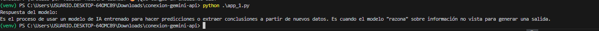
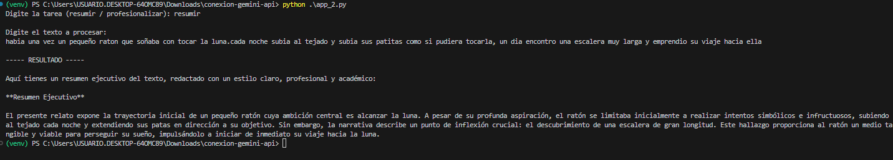
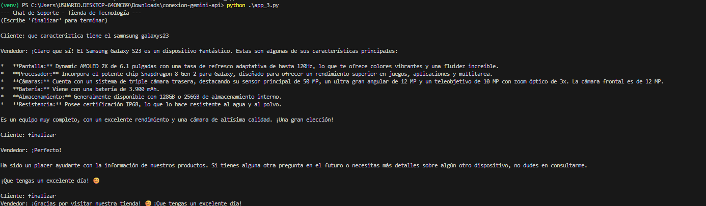

Taller: Implementación con Google Gemini API

Curso: Desarrollo de Aplicaciones con IA
Librería utilizada: google-genai
Lenguaje: Python

Descripción General

Este proyecto implementa tres ejercicios prácticos utilizando la API de Google Gemini mediante la librería google-genai.

El objetivo es demostrar:

Conexión segura a la API.

Procesamiento inteligente de textos con roles definidos.

Gestión de conversaciones interactivas con historial (Few-Shot Learning).

Instalación y Configuración
1️.Clonar el repositorio

2️.Crear entorno virtual (Opcional)
python -m venv venv
venv\Scripts\activate

3️.Instalar dependencias
pip install google-genai python-dotenv

4️.Configurar API Key

Crear un archivo .env en la raíz del proyecto

Ejercicio 1: Conexión y Petición Básica (20%)
Objetivo

Inicializar el cliente de Gemini y realizar una consulta simple donde el modelo explique qué es la inferencia en IA en menos de 50 palabras.

Implementación

Se carga la API Key desde .env.

Se inicializa el cliente con genai.Client.

Se define una system_instruction para limitar la respuesta a menos de 50 palabras.

Se utiliza client.models.generate_content() para generar la respuesta.

Evidencia de ejecución

Agregar aquí la captura de pantalla del resultado en consola:

Ejercicio 2: Procesador de Textos Inteligente (30%)
Objetivo

Desarrollar un sistema que procese textos según una tarea indicada:

resumir → Genera un resumen ejecutivo.

profesionalizar → Reescribe el texto con tono formal y técnico.

Implementación

Se define la IA como un "Editor Editorial de prestigio" usando system_instruction.

El usuario ingresa la tarea y el texto.

El prompt se construye dinámicamente.

Se genera la respuesta con generate_content().

Evidencia de ejecución

Ejercicio 3: Chat de Soporte con Historial (Few-Shot) (50%)
Objetivo

Construir un sistema de chat interactivo para una tienda de tecnología.

Características implementadas
Rol del sistema

Se define a la IA como:

Vendedor amable de una tienda de tecnología.

Contexto Few-Shot

Se precarga el historial (history) con dos ejemplos:

Pregunta sobre un producto.

Respuesta con especificaciones técnicas.

Esto permite que el modelo mantenga coherencia en estilo y formato.

Bucle interactivo

El usuario puede hacer múltiples preguntas.

El chat termina cuando se escribe "finalizar".

Se mantiene memoria conversacional usando client.chats.create().

Evidencia de ejecución

estudiante: maria paula rodriguez quitian